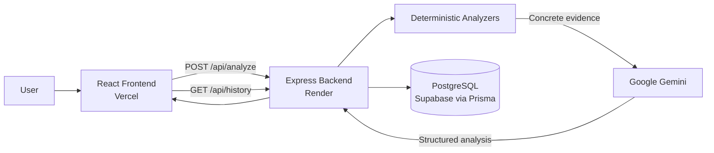

# 🦉 Night-Owl — AI Systems Debugger

> **Debug the systems. Understand the problem.**

Night-Owl is an AI-powered systems debugging and learning platform for students and developers working with **C/C++, Operating Systems, Concurrency, and Computer Networking**. Paste code, logs, errors, or network output, pick a domain, and Night-Owl explains **what went wrong, why it happened, the evidence, the root cause, how to fix it, and how to explain it in an exam or viva**.

Unlike a generic "AI code fixer", Night-Owl is built around **understanding**. It combines **deterministic analyzers** that collect concrete evidence with **Google Gemini** that turns that evidence into a structured, teachable explanation.

[](LICENSE)


### 🔗 Links

| | |
|---|---|
| 🚀 **Live Demo** | [night-owl-woad.vercel.app](https://night-owl-woad.vercel.app) |
| ⚙️ **Backend API** | [night-owl-4rg7.onrender.com](https://night-owl-4rg7.onrender.com) |
| 💻 **Repository** | [github.com/Devansh270/Night-Owl](https://github.com/Devansh270/Night-Owl) |
| 🐛 **Issues** | [github.com/Devansh270/Night-Owl/issues](https://github.com/Devansh270/Night-Owl/issues) |

---

## 📑 Table of Contents

- [Problem](#-problem)
- [Solution](#-solution)
- [Features](#-features)
- [Why the Hybrid Architecture?](#-why-the-hybrid-architecture)
- [Architecture](#️-architecture)
- [Analysis Pipeline](#-analysis-pipeline)
- [Tech Stack](#️-tech-stack)
- [Project Structure](#-project-structure)
- [Example](#-example)
- [Live Demo](#-live-demo)
- [Local Development](#️-local-development)
- [API](#-api)
- [Production Deployment](#-production-deployment)
- [Who Is It For?](#-who-is-it-for)
- [Open Source / Hacktoberfest](#-open-source--hacktoberfest)
- [Contribution Ideas](#-contribution-ideas)
- [Contributing](#-contributing)
- [Bug Reporting](#-bug-reporting)
- [Security](#-security)
- [License](#-license)
- [Author](#-author)

---

## 🎯 Problem

Systems-level bugs are hard because **the visible error is rarely the real root cause**.

Consider this C++ program:

```cpp
int main() {
    int* p = new int(10);
    delete p;
    *p = 20;
}
```

"It might crash" is not the interesting part. The real reasoning chain is:

1. Memory is allocated with `new`.
2. `delete p` releases that memory.
3. `p` still holds the old address, so it is now a **dangling pointer**.
4. `*p = 20` accesses memory whose lifetime has ended.
5. This is a **use-after-free**, which is **undefined behavior**.

Most tools stop at an error label. Students and developers need the whole chain.

## 💡 Solution

Night-Owl answers four questions for every problem:

| Question | What you get |
|---|---|
| **What went wrong?** | The detected problem and its severity |
| **Why did it go wrong?** | Root cause, supporting evidence, and the reasoning behind it |
| **How do I fix it?** | A suggested fix |
| **How do I understand and explain it?** | The underlying systems concept plus an exam-ready explanation and viva questions |

---

## ✨ Features

### C / C++

Analysis of problems such as:

- Use-after-free
- Dangling pointers
- Null dereferences
- Memory errors
- Undefined behavior
- Runtime problems
- Compiler-related issues

### OS / Concurrency

Analysis of problems involving:

- Deadlocks
- Race conditions
- Mutexes and semaphores
- Threads
- Lock ordering
- Synchronization problems

For example, with conflicting lock ordering:

```text
Thread 1:        Thread 2:
  Lock A           Lock B
  Lock B           Lock A
```

the deterministic analyzer can identify the conflicting lock order, and the AI explains the resulting concurrency problem.

### Networking

Analysis of:

- TCP
- Routing
- Packet loss
- Timeouts
- Ping failures
- Connectivity problems
- Traceroute output
- OSPF-related problems
- General network diagnostics

### Deterministic Evidence Engine

Specialized backend analyzers run **before** the AI layer and produce concrete evidence. See [Why the Hybrid Architecture?](#-why-the-hybrid-architecture).

### AI Root-Cause Analysis

Google Gemini converts the collected evidence into a structured explanation: problem, severity, root cause, evidence, why it happened, suggested fix, and the related systems concept.

### Exam Mode

Turns each debugging result into a learning and revision format:

- Definition
- Why it happened
- Short exam answer
- Viva questions

The goal is to help students understand the concept and prepare for exams and vivas, rather than copy an AI-generated fix.

### Debugging History

Structured analyses are persisted so you can revisit previous sessions through the History view.

---

## 🧠 Why the Hybrid Architecture?

Night-Owl uses **deterministic analysis + AI explanation**.

The AI is **not** solely responsible for detecting every issue. Where a specialized analyzer exists, the backend runs it first and passes the **concrete evidence** into the AI layer. This grounds the explanation in what was actually found in the input, instead of relying on the model to spot everything on its own.

| Layer | Responsibility |
|---|---|
| **Deterministic analyzers** | Detect issues and collect concrete evidence |
| **Gemini AI** | Explain the root cause, the fix, and the concept in a structured form |
| **Exam Mode** | Convert the explanation into revision material |

### Current analyzers

| Analyzer | Domain focus |
|---|---|
| `deadlockDetector.ts` | Deadlock detection |
| `raceConditionDetector.ts` | Race condition detection |
| `memoryErrorDetector.ts` | Memory error detection |
| `networkAnalyzer.ts` | Network analysis |

---

## 🏗️ Architecture



## 🔄 Analysis Pipeline

```text
User Input
    ↓
Domain Selection
    ↓
Deterministic Analyzer
    ↓
Concrete Evidence
    ↓
Gemini AI
    ↓
Structured Root-Cause Explanation
    ↓
Exam Mode
    ↓
Database / History
```

The backend:

1. Receives the analysis request.
2. Determines the selected domain.
3. Runs deterministic analysis.
4. Collects evidence.
5. Passes the relevant evidence to Gemini.
6. Generates a structured AI analysis.
7. Stores the structured analysis using Prisma.
8. Returns the result to the frontend.
9. Serves history retrieval.

### Structured result

The AI layer produces a structured result of this shape:

```json
{
  "problem": "",
  "severity": "",
  "rootCause": "",
  "evidence": "",
  "whyItHappened": "",
  "suggestedFix": "",
  "concept": "",
  "examMode": {
    "definition": "",
    "whyItHappened": "",
    "shortExamAnswer": "",
    "vivaQuestions": []
  }
}
```

### Data model

History is backed by two Prisma models:

| Model | Contains |
|---|---|
| `DebugSession` | `id`, `domain`, `createdAt`, `updatedAt` |
| `DebugAnalysis` | `problem`, `severity`, `rootCause`, `evidence`, `whyItHappened`, `suggestedFix`, `concept`, `definition`, `examWhy`, `shortExamAnswer`, `vivaQuestions` |

```text
DebugSession
    ↓
DebugAnalysis
```

The intended design is that the **structured analysis** is what gets persisted for History.

---

## 🛠️ Tech Stack

| Layer | Technologies |
|---|---|
| **Frontend** | React, TypeScript, Vite, React Router, Axios, Lucide React |
| **Backend** | Node.js, TypeScript, Express, Mastra |
| **AI** | Google Gemini, Vercel AI SDK, `@ai-sdk/google` |
| **Database** | PostgreSQL, Supabase, Prisma ORM |
| **Deployment** | Vercel (frontend), Render (backend), Supabase (database) |

---

## 📁 Project Structure

```text
Night-Owl/
│
├── frontend/
│
├── backend/
│   ├── src/
│   └── prisma/
│
├── .gitignore
├── README.md
└── LICENSE
```

The backend contains the deterministic analyzer modules `deadlockDetector.ts`, `raceConditionDetector.ts`, `memoryErrorDetector.ts`, and `networkAnalyzer.ts`.

---

## 🧪 Example

**1. The user selects** `C / C++` **and submits:**

```cpp
int main() {
    int* p = new int(10);
    delete p;
    *p = 20;
}
```

**2. The deterministic engine detects:** `Use-After-Free`

**3. The AI explains:**

| Field | Result |
|---|---|
| **Problem** | Use-After-Free |
| **Severity** | Critical |
| **Root Cause** | The pointer is dereferenced after the memory has already been released. |
| **Evidence** | `delete p` followed by `*p = 20`. |
| **Why It Happened** | The pointer becomes dangling after `delete`. |
| **Suggested Fix** | Avoid accessing memory after its lifetime ends, and prefer RAII / smart pointers where appropriate. |
| **Systems Concept** | Dangling Pointers and RAII |

**4. Exam Mode then provides:**

- Definition
- Why it happened
- Short exam answer
- Viva questions

This flow has been tested successfully on the production deployment.

---

## 🚀 Live Demo

**Frontend:** https://night-owl-woad.vercel.app

Select a domain, paste your code, logs, or errors, and submit. Try the use-after-free example above to see the full pipeline.

> The backend is hosted on Render, so the first request after a period of inactivity may take longer to respond.

---

## ⚙️ Local Development

### Prerequisites

- Node.js
- npm
- Git
- A Supabase / PostgreSQL database
- A Google Gemini API key

### Clone

```bash
git clone https://github.com/Devansh270/Night-Owl.git
cd Night-Owl
```

### Backend Setup

```bash
cd backend
npm install
```

Create a `.env` file in `backend/` (see [Environment Variables](#environment-variables)), then set up Prisma:

```bash
npx prisma generate
npx prisma db push
```

Run the backend:

```bash
npm run dev
```

### Frontend Setup

In a separate terminal:

```bash
cd frontend
npm install
npm run dev
```

### Environment Variables

**Backend** (`backend/.env`):

```env
DATABASE_URL=your_supabase_database_url
GOOGLE_GENERATIVE_AI_API_KEY=your_gemini_api_key
FRONTEND_URL=http://localhost:5173
```

**Frontend** (`frontend/.env`):

```env
VITE_API_URL=http://localhost:5000
```

> ⚠️ **Never commit `.env` files or API keys.**

---

## 🔌 API

| Method | Endpoint | Description |
|---|---|---|
| `GET` | `/api/health` | Health check |
| `POST` | `/api/analyze` | Analyze code, logs, or errors for a selected domain |
| `GET` | `/api/history` | Retrieve debugging history |

### Health check

```http
GET /api/health
```

```json
{
  "status": "ok",
  "service": "night-owl-backend"
}
```

### Analyze

```http
POST /api/analyze
```

Request body (conceptually):

```json
{
  "domain": "c_cpp",
  "code": "int main() { ... }"
}
```

The response contains the structured analysis described in [Structured result](#structured-result).

---

## 🌐 Production Deployment

| Component | Platform |
|---|---|
| Frontend | Vercel |
| Backend | Render |
| Database | Supabase PostgreSQL |
| AI | Google Gemini |

- **Frontend:** https://night-owl-woad.vercel.app
- **Backend:** https://night-owl-4rg7.onrender.com

---

## 🎓 Who Is It For?

- **Students** studying Operating Systems, Computer Networks, and C/C++ who want to understand a bug, not just patch it.
- **Exam and viva preparation**, with built-in definitions, short answers, and viva questions.
- **Developers** working with systems programming, concurrency, and network troubleshooting.
- **Contributors** interested in static analysis, developer tools, and AI-assisted education.

---

## 🌱 Open Source / Hacktoberfest

Night-Owl is open to contributions and is suitable for developers participating in Hacktoberfest and other open-source initiatives. Contributions of any size are welcome, from fixing typos to adding new analyzers.

## 💡 Contribution Ideas

The items below are **potential improvements**, not current features.

### Deterministic Analyzers

- Buffer overflow detection
- Double-free detection
- Memory leak detection
- Stack overflow detection
- Starvation detection
- Livelock detection
- Semaphore misuse
- Synchronization issues
- DNS troubleshooting
- ARP troubleshooting
- Additional TCP diagnostics
- Additional routing analysis

### AI

- Prompt improvements
- Better explanations
- Better structured output
- Better exam answers
- Better viva questions
- Domain-specific reasoning

### Frontend

- Better code editor
- Syntax highlighting
- Visualization
- Deadlock graphs
- Race-condition timelines
- Network visualization
- Responsive UI
- Accessibility
- UX improvements

### Testing

- Unit tests
- Analyzer tests
- API tests
- Integration tests
- Regression tests

### Documentation

- Tutorials
- Examples
- Systems concepts
- API docs
- Developer documentation

---

## 🤝 Contributing

1. **Fork** the repository.
2. **Clone** your fork:
   ```bash
   git clone https://github.com/<your-username>/Night-Owl.git
   cd Night-Owl
   ```
3. **Create a feature branch:**
   ```bash
   git checkout -b feature/your-feature
   ```
4. **Make your changes.**
5. **Test your changes** locally.
6. **Commit:**
   ```bash
   git add .
   git commit -m "Add your feature"
   ```
7. **Push:**
   ```bash
   git push origin feature/your-feature
   ```
8. **Open a Pull Request** against `main`.

In your Pull Request, please explain:

- **What** you changed
- **Why** you changed it
- **How** you tested it
- **Screenshots or examples**, if relevant

---

## 🐛 Bug Reporting

Please open an issue at **https://github.com/Devansh270/Night-Owl/issues** and include:

- Description of the problem
- Steps to reproduce
- Expected behavior
- Actual behavior
- Logs
- Screenshots
- The domain being analyzed (C/C++, OS/Concurrency, or Networking)

> ⚠️ **Do not post** API keys, passwords, database credentials, `.env` contents, or private tokens in issues, pull requests, or screenshots.

---

## 🔒 Security

- Never commit `.env` files, API keys, or database credentials.
- Keep `GOOGLE_GENERATIVE_AI_API_KEY` and `DATABASE_URL` private.
- If you accidentally expose a secret, rotate it immediately.

---

## 📜 License

This project is licensed under the MIT License. See [LICENSE](LICENSE) for details.

---

## 👨‍💻 Author

**Devansh Mehta**
B.Tech Information Technology, VJTI, Mumbai

GitHub: [@Devansh270](https://github.com/Devansh270)

---

## ⭐ Support the Project

If Night-Owl helped you understand a systems problem, consider:

- ⭐ Starring the repository
- 🐛 Reporting bugs
- 🔧 Contributing an analyzer, a fix, or documentation
- 📣 Sharing it with classmates and fellow developers

**Debug the systems. Understand the problem.** 🦉
